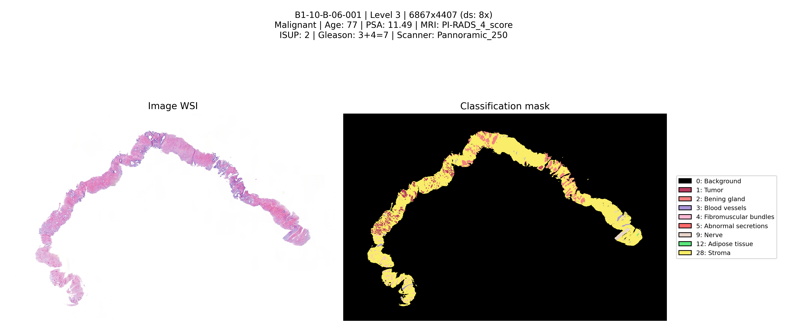

# WSI Histology Mask Annotator

[](https://tinyurl.com/prostate-wsi-dataset)

Pipeline for exporting, post-processing, and visualizing Whole Slide Imaging (WSI) histology images with multiclass annotations. Designed for efficient processing of large digital pathology datasets with semantic annotations exported from QuPath.

---

## Table of contents

1. [Overview](#overview)
2. [Groovy script for QuPath](#groovy-script-for-qupath)
3. [Python pipeline](#python-pipeline)
4. [QuPath Handler and visualization](#qupath-handler-and-visualization)
5. [Installation](#installation)
6. [License and citation](#license-and-citation)

---

## Overview

This repository provides a complete workflow for:

1. **Export from QuPath**: Groovy script that iterates over all images in a QuPath project, computes the bounding box of annotations, crops the region of interest, and exports image and mask in pyramidal OME-TIFF format with lossless compression.

2. **Mask post-processing**: Python script that detects unannotated tissue via thresholding and labels it as *Stroma* (class 28), completing the semantic segmentation.

3. **Interactive visualization**: Python class to explore image/mask pairs with synchronized zoom, resolution level switching, and high-quality figure export.

---

## Groovy script for QuPath

### Description

The `export_cropped.groovy` script is designed to run inside QuPath (v0.6.x or higher). It iterates over all images in the open project and, for each one:

1. **Bounding box calculation**: Retrieves annotations from the hierarchy and computes the minimum enclosing rectangle containing all annotated regions, excluding the *Artifact* class to prevent scan artifacts at the edges from unnecessarily expanding the crop.

2. **Margin application**: Adds a configurable margin (default 10%) to the bounding box to include context around the annotations, respecting image boundaries.

3. **Efficient tile-based export**: Uses `OMEPyramidWriter` with 512×512 pixel tile writing, generating a coherent multilevel pyramid (1×, 2×, 4×, 8×, 16×, 32×) and **LZW (lossless)** compression to minimize file size without information loss.

4. **Dual output**: Exports both the cropped RGB image and the multiclass classification mask with the same region and pyramidal structure.

### Output structure

```
OUTPUT_DIR/
├── images/
│   ├── imagen1.ome.tif
│   └── imagen2.ome.tif
└── masks/
    ├── imagen1__mask_multiclass.ome.tif
    └── imagen2__mask_multiclass.ome.tif
```

### RGB image format

- **Format**: Pyramidal OME-TIFF (`.ome.tif`)
- **Channels**: RGB (3 channels, 8 bits per channel)
- **Compression**: LZW (lossless)
- **Tiles**: 512×512 pixels
- **Pyramid**: 6 levels (downsamples 1×, 2×, 4×, 8×, 16×, 32×)

### Mask format

- **Format**: Pyramidal OME-TIFF (`.ome.tif`)
- **Type**: Grayscale (1 channel, 8 bits)
- **Encoding**: Each pixel value corresponds to the class ID (0 = background, 1–27 = annotated classes)
- **Compression**: LZW (lossless)
- **Tiles**: 512×512 pixels
- **Pyramid**: Identical to the image (same region, same levels)

### Generated classes (27 annotated classes + background)

| ID | Class |
|----|-------|
| 0 | Background |
| 1 | Tumor |
| 2 | Bening gland |
| 3 | Blood vessels |
| 4 | Fibromuscular bundles |
| 5 | Abnormal secretions |
| 6 | Contamination with another tissue |
| 7 | Prominent nucleolus |
| 8 | Immune cells |
| 9 | Nerve |
| 10 | Artifact |
| 11 | Seminal vesicle |
| 12 | Adipose tissue |
| 13 | Normal secretions |
| 14 | Stromal retraction spaces |
| 15 | Muscle |
| 16 | Foreign body contamination |
| 17 | High grade prostatic intraepithelial neoplasia (HGPIN) |
| 18 | Calcifications |
| 19 | Intestinal glands and mucus |
| 20 | Perineural invasion (PNI) |
| 21 | Hemorrahage |
| 22 | Intraductal carcinoma |
| 23 | Necrosis |
| 24 | Mitosis |
| 25 | Nerve ganglion |
| 26 | Atypical intraductal proliferation |
| 27 | Red blood cells |

### Using the Groovy script

1. Open the project in QuPath.
2. Edit the configuration variables at the beginning of the script:
   - `OUTPUT_DIR`: output directory
   - `MARGIN_RATIO`: margin (0.1 = 10%)
   - `IGNORE_CLASS_NAME`: class to ignore for bounding box calculation (default `"Artifact"`)
3. Run the script with `Ctrl+R` (or *Run* in the scripts menu).

---

## Python pipeline


## Installation

```bash
git clone https://github.com/abelBEDOYA/wsi-histology-mask-annotator.git
cd wsi-histology-mask-annotator
pip install -r requirements.txt
```


### add_stroma.py

Script that adds the **Stroma** class (ID 28) to masks in tissue regions that have no annotations. It uses tissue detection via intensity thresholding: pixels with mean RGB value below the threshold are considered tissue; those that also have value 0 in the original mask are labeled as Stroma.

#### Thresholding parameters

| Parameter | Description | Default |
|-----------|-------------|---------|
| `--threshold`, `-t` | Whiteness threshold (0–255). Lower values = more sensitive (more tissue detected) | 240 |
| `--blur`, `-b` | Blur before thresholding (px) | 0 |
| `--dilate`, `-d` | Tissue mask dilation (px) | 0 |
| `--erode`, `-e` | Tissue mask erosion (px) | 0 |
| `--min-area`, `-a` | Minimum region area (px) to filter noise | 0 |


#### Usage

```bash
# Process entire dataset
python add_stroma.py /path/to/dataset

# With custom parameters
python add_stroma.py /path/to/dataset --threshold 235 --dilate 10 --erode 5

# Preview to adjust threshold (without saving)
python add_stroma.py /path/to/dataset --preview

# Process single image only
python add_stroma.py /path/to/dataset --name "imagen_001"

# Output to alternative directory
python add_stroma.py /path/to/dataset --output /path/to/masks_with_stroma
```

Output is saved by default in `dataset/masks_with_stroma/`. Generated masks preserve the original OME-TIFF pyramidal structure with LZW compression.

---

## QuPath Handler and visualization

### Description

The `qupath_handler.py` module provides the `QuPathHandler` class to load, explore, and visualize image/mask pairs exported from QuPath. It is optimized to avoid RAM saturation through pyramid-level reading and lazy loading.

<p align="center">
  
</p>


### Command-line usage

```bash
# Visualize all images in the dataset
python qupath_handler.py /path/to/data

# Batch mode: save PNG of all images without opening windows
python qupath_handler.py /path/to/data --batch-save

# Custom save resolution (default: 3840 px = 4K)
python qupath_handler.py /path/to/data --save-resolution 7680
```

### What it displays

When using `QuPathHandler`, the following is shown:

1. **Left panel**: WSI histology image (RGB) at the selected pyramid level.
2. **Right panel**: Multiclass classification mask with semantic colors per class (see `CLASS_COLORS_HEX` in the code).
3. **Legend**: Classes present in the mask with their ID and name.
4. **Synchronized zoom/pan**: When zooming or panning in one panel, the other updates automatically.
5. **Clinical information** (if `clinical_diagnosis.txt` exists): Diagnosis, ISUP, Gleason, scanner, age, PSA, etc., in the title.

Saved figures (key **S** or `--batch-save` mode) are stored by default in `preview/` (or the directory specified with `--output-dir`). A sample visual output can be found in `assets/` (if reference images are included in the repository).

---


## License and citation

### License

This project is distributed under the **MIT License**. See the [LICENSE](LICENSE) file for details.

### Citation

If you use this software in your research, please cite:

```bibtex
@software{wsi_histology_mask_annotator,
  author = {González Bernad, Abel Amado and Calapaquí Terán, Adriana K. and Lloret Iglesias, Lara and Moustafá Calvo, Jaled},
  title = {WSI Histology Mask Annotator: Pipeline for QuPath export and stroma annotation},
  year = {2026},
  url = {https://github.com/abelBEDOYA/wsi-histology-mask-annotator},
  license = {MIT}
}
```
