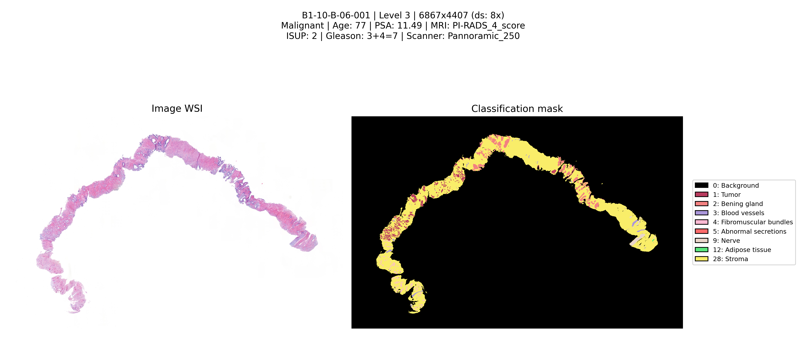

# WSI Histology Mask Annotator

[](https://tinyurl.com/prostate-wsi-dataset)

Pipeline for exporting, post-processing, and visualizing Whole Slide Imaging (WSI) histology images with multiclass annotations. Designed for efficient processing of large digital pathology datasets with semantic annotations exported from QuPath.

---

## Table of contents

1. [Overview](#overview)
2. [Groovy scripts for QuPath](#groovy-scripts-for-qupath)
3. [Installation](#installation)
4. [Python pipeline](#python-pipeline)
5. [QuPath Handler and visualization](#qupath-handler-and-visualization)
6. [GeoJSON overlay visualization](#geojson-overlay-visualization)
7. [Groovy scripts: technical reference](#groovy-scripts-technical-reference)
8. [License and citation](#license-and-citation)

---

## Overview

This repository provides a complete workflow for:

1. **Export from QuPath**: Two Groovy scripts that iterate over all images in a QuPath project, compute the bounding box of annotations (excluding the *Artifact* class), crop the region of interest with a configurable margin, and export: (a) the cropped RGB image and multiclass mask in pyramidal OME-TIFF format with lossless LZW compression (`export_cropped.groovy`), and (b) the vector annotations as GeoJSON with coordinates normalized to relative [0, 1] space (independent of resolution; multiply by crop width/height to recover cropped pixel coordinates) (`export_geojson_cropped.groovy`).

2. **Mask post-processing**: Python script that detects unannotated tissue via intensity thresholding and labels it as *Stroma* (class 28), completing the semantic segmentation.

3. **Interactive visualization**: Python modules to explore image/mask pairs with synchronized zoom and resolution level switching (`qupath_handler.py`), and to overlay GeoJSON annotation boundaries on the corresponding pyramidal OME-TIFF for visual alignment verification (`visualize_geojson_overlay.py`).

---

## Groovy scripts for QuPath

Two Groovy scripts are provided, both designed to run inside QuPath (v0.6.x or higher). They share the same bounding box calculation and margin logic, but differ in their output modality. A detailed technical reference is provided at the end of this document.

### `export_cropped.groovy` — Image and mask export

Iterates over all images in the open QuPath project and, for each one:

1. **Bounding box calculation**: Retrieves annotations from the hierarchy and computes the minimum enclosing rectangle containing all annotated regions, excluding the *Artifact* class to prevent scan artifacts at the edges from unnecessarily expanding the crop.

2. **Margin application**: Adds a configurable margin (default 10%) to the bounding box to include context around the annotations, respecting image boundaries.

3. **Efficient tile-based export**: Uses `OMEPyramidWriter` with 512×512 pixel tile writing, generating a coherent multilevel pyramid (1×, 2×, 4×, 8×, 16×, 32×) and **LZW (lossless)** compression to minimize file size without information loss.

4. **Dual output**: Exports both the cropped RGB image and the multiclass classification mask with the same region and pyramidal structure.

### `export_geojson_cropped.groovy` — Vector annotation export

Iterates over all images in the open QuPath project and, for each one:

1. **Identical crop region**: Uses the same bounding box and margin as `export_cropped.groovy` to ensure spatial correspondence.

2. **Coordinate transformation**: Translates all annotation geometries by `(-cropX, -cropY)`, clips them to the crop rectangle, and normalizes coordinates to relative [0, 1] space by dividing by crop width and height. This makes the GeoJSON resolution-independent: to recover pixel coordinates, multiply by the width and height of the rendered image.

3. **Boundary clipping**: Intersects each geometry with the crop rectangle to remove portions that fall outside, preventing negative or out-of-bounds coordinates.

4. **GeoJSON output**: Exports all annotations (including the *Artifact* class) as a GeoJSON FeatureCollection with class metadata, ROI type, and pixel area per feature.

### Output structure

```
OUTPUT_DIR/
├── images/
│   ├── imagen1.ome.tif
│   └── imagen2.ome.tif
├── semantic_masks/
│   ├── imagen1__mask_multiclass.ome.tif
│   └── imagen2__mask_multiclass.ome.tif
└── vector_labels/
    ├── imagen1_annotations.geojson
    └── imagen2_annotations.geojson
```

### RGB image format

- **Format**: Pyramidal OME-TIFF (`.ome.tif`)
- **Channels**: RGB (3 channels, 8 bits per channel)
- **Compression**: LZW (lossless)
- **Tiles**: 512×512 pixels
- **Pyramid**: 6 levels (downsamples 1×, 2×, 4×, 8×, 16×, 32×)

### Mask format

- **Format**: Pyramidal OME-TIFF (`.ome.tif`)
- **Type**: Grayscale (1 channel, 8 bits)
- **Encoding**: Each pixel value corresponds to the class ID (0 = background, 1–28 = annotated classes)
- **Compression**: LZW (lossless)
- **Tiles**: 512×512 pixels
- **Pyramid**: Identical to the image (same region, same levels)

### Generated classes (27 manually annotated + 1 auto-generated Stroma + background)

| ID | Class |
|----|-------|
| 0 | Background |
| 1 | Tumor |
| 2 | Benign gland |
| 3 | Blood vessels |
| 4 | Fibromuscular bundles |
| 5 | Abnormal secretions |
| 6 | Contamination with another tissue |
| 7 | Prominent nucleolus |
| 8 | Immune cells |
| 9 | Nerve |
| 10 | Artifact |
| 11 | Seminal vesicle |
| 12 | Adipose tissue |
| 13 | Normal secretions |
| 14 | Stromal retraction spaces |
| 15 | Muscle |
| 16 | Foreign body contamination |
| 17 | High grade prostatic intraepithelial neoplasia (HGPIN) |
| 18 | Calcifications |
| 19 | Intestinal glands and mucus |
| 20 | Perineural invasion (PNI) |
| 21 | Hemorrhage |
| 22 | Intraductal carcinoma |
| 23 | Necrosis |
| 24 | Mitosis |
| 25 | Nerve ganglion |
| 26 | Atypical intraductal proliferation |
| 27 | Red blood cells |
| 28 | Stroma (auto-generated) |

### Using the Groovy scripts

1. Open the project in QuPath.
2. Edit the configuration variables at the beginning of the script:
   - `OUTPUT_DIR`: output directory
   - `MARGIN_RATIO`: margin (0.1 = 10%)
   - `IGNORE_CLASS_NAME`: class to ignore for bounding box calculation (default `"Artifact"`)
3. Run the script with `Ctrl+R` (or *Run* in the scripts menu).

---

## Installation

```bash
git clone https://github.com/abelBEDOYA/wsi-histology-mask-annotator.git
cd wsi-histology-mask-annotator
pip install -r requirements.txt
```


## Python pipeline

### add_stroma.py

Script that adds the **Stroma** class (ID 28) to masks in tissue regions that have no annotations. It uses tissue detection via intensity thresholding: pixels with mean RGB value below the threshold are considered tissue; those that also have value 0 in the original mask are labeled as Stroma.

#### Thresholding parameters

| Parameter | Description | Default |
|-----------|-------------|---------|
| `--threshold`, `-t` | Whiteness threshold (0–255). Lower values = more sensitive (more tissue detected) | 240 |
| `--blur`, `-b` | Blur before thresholding (px) | 0 |
| `--dilate`, `-d` | Tissue mask dilation (px) | 0 |
| `--erode`, `-e` | Tissue mask erosion (px) | 0 |
| `--min-area`, `-a` | Minimum region area (px) to filter noise | 0 |


#### Usage

```bash
# Process entire dataset
python add_stroma.py /path/to/dataset

# With custom parameters
python add_stroma.py /path/to/dataset --threshold 235 --dilate 10 --erode 5

# Preview to adjust threshold (without saving)
python add_stroma.py /path/to/dataset --preview

# Process single image only
python add_stroma.py /path/to/dataset --name "imagen_001"

# Output to alternative directory
python add_stroma.py /path/to/dataset --output /path/to/masks_with_stroma
```

Output is saved by default in `dataset/masks_with_stroma/`. Generated masks preserve the original OME-TIFF pyramidal structure with LZW compression.

---

## QuPath Handler and visualization

### Description

The `qupath_handler.py` module provides the `QuPathHandler` class to load, explore, and visualize image/mask pairs exported from QuPath. It is optimized to avoid RAM saturation through pyramid-level reading and lazy loading.

<p align="center">
  
</p>


### Command-line usage

```bash
# Visualize all images in the dataset
python qupath_handler.py /path/to/data

# Batch mode: save PNG of all images without opening windows
python qupath_handler.py /path/to/data --batch-save

# Custom save resolution (default: 3840 px = 4K)
python qupath_handler.py /path/to/data --save-resolution 7680
```

### What it displays

When using `QuPathHandler`, the following is shown:

1. **Left panel**: WSI histology image (RGB) at the selected pyramid level.
2. **Right panel**: Multiclass classification mask with semantic colors per class (see `CLASS_COLORS_HEX` in the code).
3. **Legend**: Classes present in the mask with their ID and name.
4. **Synchronized zoom/pan**: When zooming or panning in one panel, the other updates automatically.
5. **Clinical information** (if `clinical_diagnosis.csv` exists): Diagnosis, ISUP, Gleason, scanner, age, PSA, etc., in the title.

Saved figures (key **S** or `--batch-save` mode) are stored by default in `previews/` (or the directory specified with `--output-dir`). A sample visual output can be found in `assets/` (if reference images are included in the repository).

---

## GeoJSON overlay visualization

### Description

The `visualize_geojson_overlay.py` script provides a lightweight tool to verify the spatial alignment between the cropped pyramidal OME-TIFF images and their corresponding GeoJSON vector annotations. It loads both modalities, scales the annotation coordinates to match the selected pyramid level, and renders the polygons as a semi-transparent overlay with class-colored outlines.

### Command-line usage

```bash
# Interactive: list available image/geojson pairs, choose one
python visualize_geojson_overlay.py /path/to/dataset

# Specific image at pyramid level 0 (full resolution)
python visualize_geojson_overlay.py /path/to/dataset --name B1-01-A-01-001 --level 0

# Auto-level selection (fits in ~4 MP), save to PNG
python visualize_geojson_overlay.py /path/to/dataset --name B1-01-A-01-001 --save overlay.png

# Adjust transparency and outline width
python visualize_geojson_overlay.py /path/to/dataset --name B1-01-A-01-001 --alpha 0.4 --linewidth 2.0
```

### Parameters

| Flag | Default | Description |
|------|---------|-------------|
| `dataset_dir` | — | Root export directory containing `images/` and `vector_labels/` subdirectories |
| `--name`, `-n` | interactive list | Base image name (e.g. `B1-01-A-01-001`) |
| `--level`, `-l` | auto (~4 MP) | Pyramid level to load (0 = full resolution) |
| `--alpha`, `-a` | 0.25 | Polygon fill transparency (0.0–1.0) |
| `--linewidth`, `-w` | 1.0 | Outline stroke width in points |
| `--save`, `-s` | None | Save figure to file instead of displaying interactively |
| `--dpi` | 150 | Output resolution for saved figures |
| `--geojson-subdir` | `vector_labels` | Subdirectory for `.geojson` files |
| `--images-subdir` | `images` | Subdirectory for `.ome.tif` files |

### What it displays

1. **Background**: The cropped RGB histology image loaded at the requested pyramid level.
2. **Overlay**: All GeoJSON polygon features rendered with class-colored boundaries and a semi-transparent fill.
3. **Legend**: Classes present in the GeoJSON with their ID and name.
4. **Title bar**: Image name, pyramid level, display dimensions, downsampling factor, and crop metadata.

### Coordinate alignment guarantee

The GeoJSON coordinates produced by `export_geojson_cropped.groovy` are normalized to **relative [0, 1] space** (each coordinate is divided by `cropW` and `cropH`). This makes the annotations resolution-independent: to map them onto the displayed image, multiply by the rendered width and height at the chosen pyramid level. This ensures that each polygon vertex maps to the same pixel in both the TIFF and the GeoJSON, enabling pixel-exact overlay for visual quality control.

---

## Groovy scripts: technical reference

### Execution context

Both `export_cropped.groovy` and `export_geojson_cropped.groovy` are **Groovy scripts** executed from within the QuPath graphical interface. Groovy is a JVM-based scripting language that QuPath embeds as its primary automation engine. Scripts have direct access to the QuPath Java API — including the image server, object hierarchy, ROI geometries, and export writers — via implicitly available objects such as `getProject()`, `getCurrentImageData()`, and the `buildFilePath()` utility. Scripts are run via **Run → Run script** (`Ctrl+R`) in the QuPath script editor.

### Shared pipeline: bounding box and crop logic

Both scripts share an identical preprocessing pipeline that determines the region of interest:

1. **Annotation collection**: All `PathAnnotationObject` instances are retrieved from the image hierarchy using `hierarchy.getObjects(null, PathAnnotationObject)`.

2. **Bounding box computation** (`calculateAnnotationsBBox`): The minimum axis-aligned bounding rectangle enclosing all valid annotations is computed. Annotations belonging to the *Artifact* class are excluded from this calculation because they typically mark scanning artifacts, damaged regions, or tissue folds near the slide edges that would otherwise inflate the crop region unnecessarily. The exclusion applies **only** to the bounding box; Artifact annotations are still exported in the GeoJSON output.

3. **Margin expansion** (`addMargin`): The bounding box is enlarged by a configurable percentage (default 10% of width and height) to include surrounding tissue context. The expansion is clamped to the image boundaries.

### `export_cropped.groovy`: raster export pipeline

This script produces two pyramidal OME-TIFF files per image using the following pipeline:

**Image export**:
- A `RegionRequest` is created from the cropped bounding box at full resolution (level 0).
- An `OMEPyramidWriter` is configured with the original image server as source, the crop region, 512×512 pixel tiles, a fixed pyramid of six levels (downsamples: 1×, 2×, 4×, 8×, 16×, 32×), and **LZW lossless compression**.
- The writer generates a coherent multiresolution pyramid where each downsampled level is computed from the preceding one, ensuring consistent tile boundaries across levels.
- Output format: 8-bit RGB (3-channel) OME-TIFF.

**Mask export**:
- A `LabeledImageServer` is constructed from the image data, configured to render annotations as integer label values rather than colored overlays.
- Each of the 27 annotated classes is registered with its 1-based class ID (`labelBuilder.addLabel(name, i + 1)`). Unannotated pixels receive label 0 (background).
- The label server is wrapped in an `OMEPyramidWriter` with **identical** region, tile size, pyramid structure, and compression as the image export, guaranteeing pixel-level spatial correspondence between the image and mask pyramids.
- Output format: 8-bit single-channel integer OME-TIFF where each pixel value encodes the class ID.

**Compression**: Both image and mask use **LZW (Lempel-Ziv-Welch)** lossless compression, which reduces file size without any information loss — essential for preserving the integrity of integer-valued mask labels.

### `export_geojson_cropped.groovy`: vector export pipeline

This script produces one GeoJSON file per image with the following processing:

**ROI-to-geometry conversion**: Each annotation's ROI (which may be a polygon, rectangle, ellipse, or polyline, depending on the annotation tool used in QuPath) is converted to a JTS (Java Topology Suite) `Geometry` object via `GeometryTools.roiToGeometry()`. This normalizes all ROI types into a unified geometric representation.

**Affine translation**: A JTS `AffineTransformation` is applied to translate every geometry by `(-cropX, -cropY)`, shifting coordinates from the original WSI pixel space to the cropped image pixel space.

**Boundary clipping**: Each translated geometry is intersected with the crop bounding rectangle `[0, 0, cropW, cropH]`. Geometries that fall entirely outside the crop are discarded (counted as `skipped_clipped` in the metadata). Geometries that partially overlap are clipped to the visible region, preventing negative or out-of-bounds coordinates.

**Serialization and normalization**: The clipped JTS geometries are converted to GeoJSON coordinate arrays using a custom `jtsToGeoJSONGeometry()` function. Supported geometry types include `Polygon`, `MultiPolygon`, `Point`, `MultiPoint`, `LineString`, `MultiLineString`, and `GeometryCollection`. During serialization, all coordinates are divided by `cropW` and `cropH` to produce **relative [0, 1] values**, making the GeoJSON independent of the original image resolution. No rounding is applied: coordinates are preserved at full double precision.

**Output structure**: Each file is a GeoJSON FeatureCollection (RFC 7946) containing:
- A `features` array where each feature includes the GeoJSON geometry and a `properties` object with `classification` (name and integer ID), `wsi_name`, `anonymous_code`, `roi_type` (the original QuPath ROI type), and `area_pixels` (area after clipping, in cropped pixel units).
- A top-level `metadata` object recording the original image dimensions, crop offset and size, margin ratio, and counts of total, exported, and skipped features.

**Coordinate reference system**: No CRS is declared. Coordinates are normalized to relative [0, 1] space (pixel coordinate divided by crop width/height). To recover pixel coordinates in the cropped image, multiply by the `crop_width` and `crop_height` values recorded in the GeoJSON metadata.

**JSON serialization**: The Groovy map structure is serialized to a pretty-printed JSON string using the Gson library (`com.google.gson`), which is bundled with QuPath.

---

## License and citation

### License

This project is shared under a **Creative Commons Attribution 4.0 International (CC BY 4.0)** license. This allows others to copy, redistribute, and adapt the material for any purpose, including commercial use. Appropriate credit must be given to the authors. See the [LICENSE](LICENSE) file for details.

### Citation

If you use this software in your research, please cite:

```bibtex
@software{wsi_histology_mask_annotator,
  author = {González Bernad, Abel Amado and Calapaquí Terán, Adriana K. and Lloret Iglesias, Lara and Moustafá Calvo, Jaled},
  title = {WSI Histology Mask Annotator: Pipeline for QuPath export and stroma annotation},
  year = {2026},
  url = {https://github.com/abelBEDOYA/wsi-histology-mask-annotator},
  license = {CC-BY-4.0}
}
```
